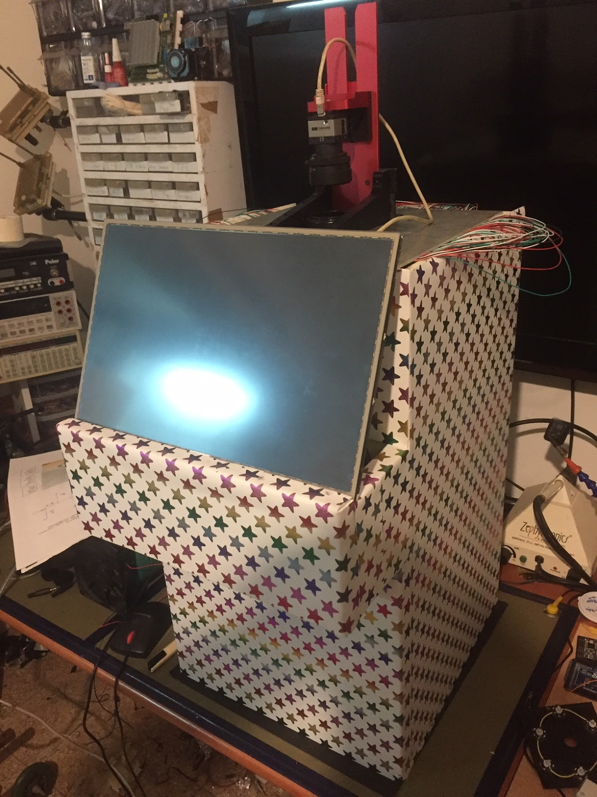
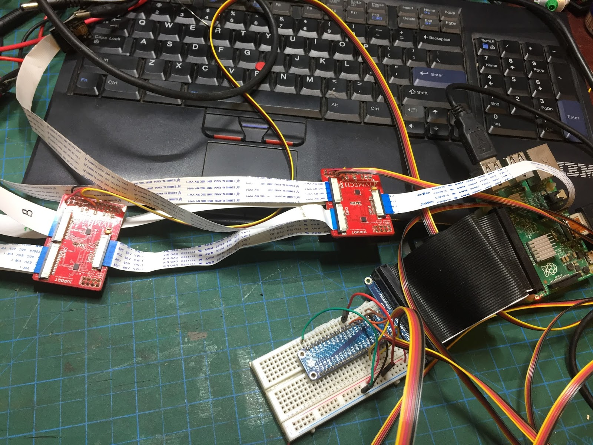
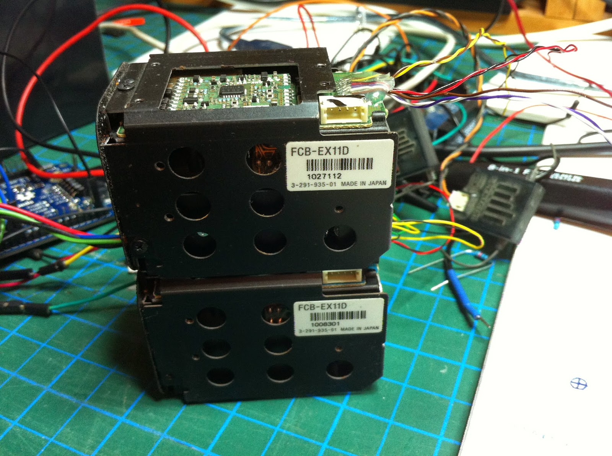

# DIY Electronics, Imaging & Raspberry Pi Project Code

A curated code companion to hardware projects by **Elad Orbach**, covering Raspberry Pi imaging, camera multiplexing, Arduino camera control, optics, and embedded experiments.

The original build articles contain photographs, measurements, hardware context, and development history. This repository keeps the surviving code easier to find, read, and reuse.

## Project gallery

| Active multispectral imaging | Cascaded IVPort camera multiplexer | Sony VISCA RC zoom |
|---|---|---|
|  |  |  |

## Projects

| Project | Platform | What is included |
|---|---|---|
| [Active Multispectral Imaging](projects/active-multispectral-imaging/) | Raspberry Pi / Python / PCA9685 | Original 2019 script, cleaned 48-channel PWM helper, and sequencer |
| [Cascaded IVPort Camera Multiplexers](projects/ivport-camera-multiplexer/) | Raspberry Pi / Python / GPIO | Original six-camera script and cleaned route selector |
| [Sony VISCA RC Zoom](projects/sony-visca-rc-zoom/) | Arduino / C++ | Original Arduino + ATtiny85 sketches and cleaned transmit-only controller |

## Original project articles

- [Raspberry Pi active multispectral imaging system](https://www.eladorbach.com/2019/04/multi-spectral-imaging-system.html)
- [Multiple Raspberry Pi cameras using cascaded IVPort multiplexers](https://www.eladorbach.com/2017/06/multiple-raspberry-pi-cameras-using.html)
- [Arduino RC control for a Sony block camera using VISCA](https://www.eladorbach.com/2014/11/controlling-camera-with-rc-remote.html)

## Repository structure

Where the original source survived, each project keeps two layers:

- **`legacy/`** — code as originally published, with formatting normalized where Blogger damaged indentation.
- **`src/`** — cleaned code for easier reading and reuse.

Each project README separates the original hardware and wiring from later notes or unverified modernization. Hardware-specific behavior should still be verified on the exact board or camera revision before connecting equipment.

## Why this archive exists

The projects span several generations of Raspberry Pi, Arduino, camera hardware, and supporting software. Keeping the code beside concise technical notes makes the older work searchable without pretending that every historical dependency is current.

## Safety

These projects interface with external power supplies, camera control lines, LED drivers, and optical hardware. Confirm logic levels, grounds, current limiting, connector pinouts, and device-specific limits before connecting equipment. Near-UV and high-power LEDs require appropriate eye and skin protection.

## Provenance

Project photographs and original build context come from the corresponding articles on **[eladorbach.com](https://www.eladorbach.com)**. Code in this repository is either preserved from the restored archive or rewritten from the documented wiring and behavior, with unverified changes explicitly identified.
