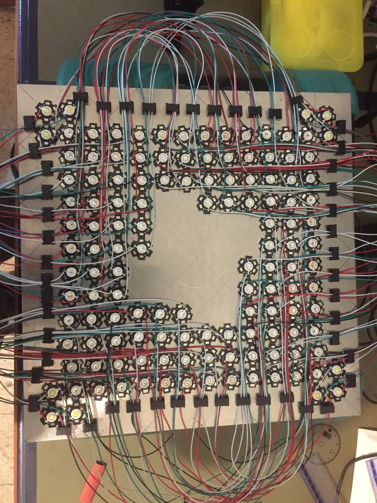
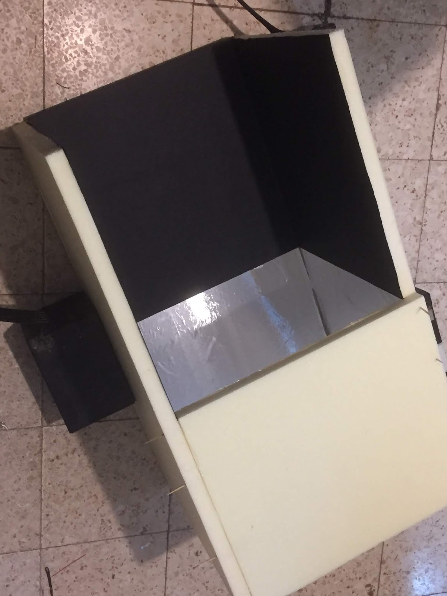
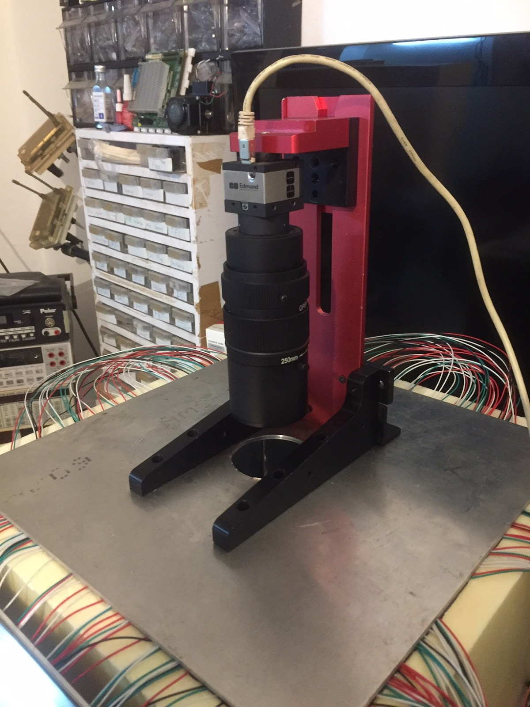

# Raspberry Pi Active Multispectral Imaging System


A Raspberry Pi-controlled **active multispectral imaging system** that illuminates a specimen one spectral band at a time and captures a monochrome image for each wavelength band.

The original build used more than 30 measured LED types spanning roughly **370–880 nm**, three PCA9685 PWM controllers at `0x40`, `0x41`, and `0x42`, MOSFET/driver stages, a Mean Well LDD-700H constant-current driver, a Raspberry Pi and an IDS monochrome industrial camera.

Read the original build article: **[Raspberry Pi active multispectral imaging system](https://www.eladorbach.com/2019/04/multi-spectral-imaging-system.html)**.

## Gallery

| LED array | Enclosure | Camera mount |
|---|---|---|
|  |  |  |

The original 2019 script is preserved under [`legacy/`](legacy/) with Blogger whitespace normalized. It is historical code, not the recommended implementation.

## Raspberry Pi multispectral imaging code

`src/led_controller.py` is a cleaned version of the surviving PCA9685 control code from the restored blog archive. It exposes the three boards as one 48-channel output space and accepts the same 12-bit `0..4095` duty values used by the original project.

`src/sequence.py` adds a small band-sequencing scaffold. Camera capture is deliberately supplied as a callback instead of embedding the old IDS camera initialization inside every LED iteration. This keeps the illumination logic usable with pyueye, IDS peak, OpenCV, or another camera stack.

### Install the PCA9685 dependency

```bash
python3 -m pip install adafruit-circuitpython-pca9685
```

The current Adafruit CircuitPython PCA9685 API uses a 16-bit `duty_cycle`; the helper converts the project's original 12-bit values to that range.

## Electrical notes

The PCA9685 outputs are **control signals**, not LED power outputs. Drive high-power LED branches through appropriate MOSFET/driver/current-regulator stages. Confirm whether your external driver chain is active-high or active-low before enabling a full array.

## Calibration workflow

A practical reflectance workflow is:

1. capture a dark frame;
2. capture a white-reference frame for each spectral band;
3. capture the specimen with the same geometry/exposure;
4. compute normalized reflectance approximately as `(sample - dark) / (white - dark)`;
5. reject saturated or near-zero reference pixels.

For quantitative work, store wavelength/band identity, PWM setting, exposure, gain, timestamp, temperature if relevant, and the reference frame used for each capture.

## Status

The PWM helper is syntax-checked but has not been hardware-tested here on the original station. Camera integration remains hardware/SDK specific.
