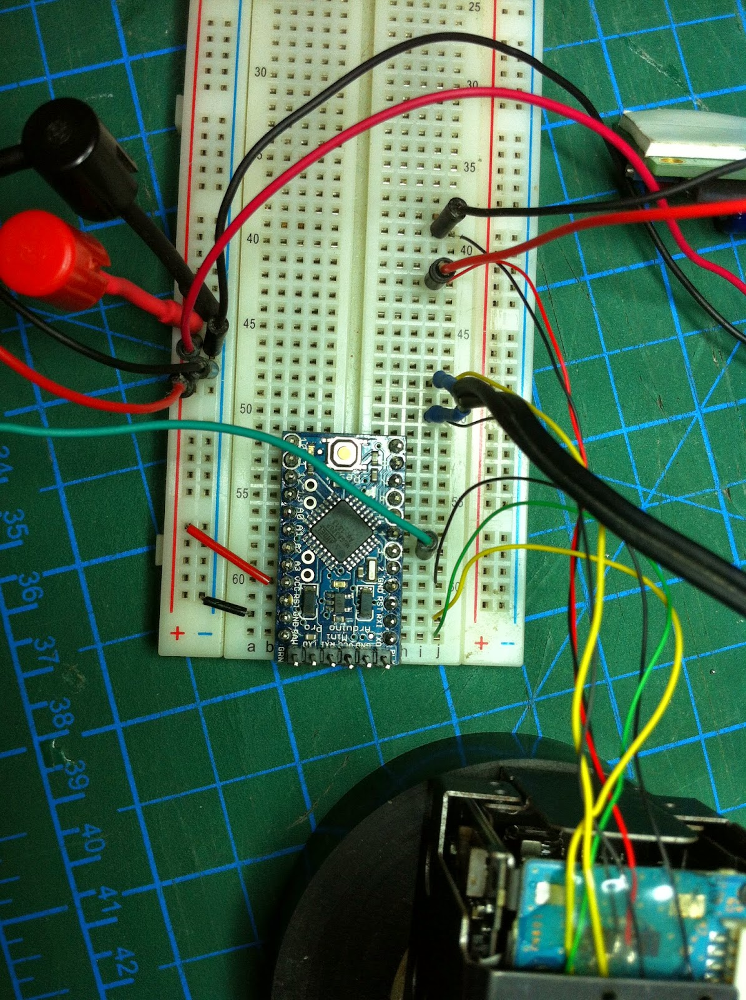
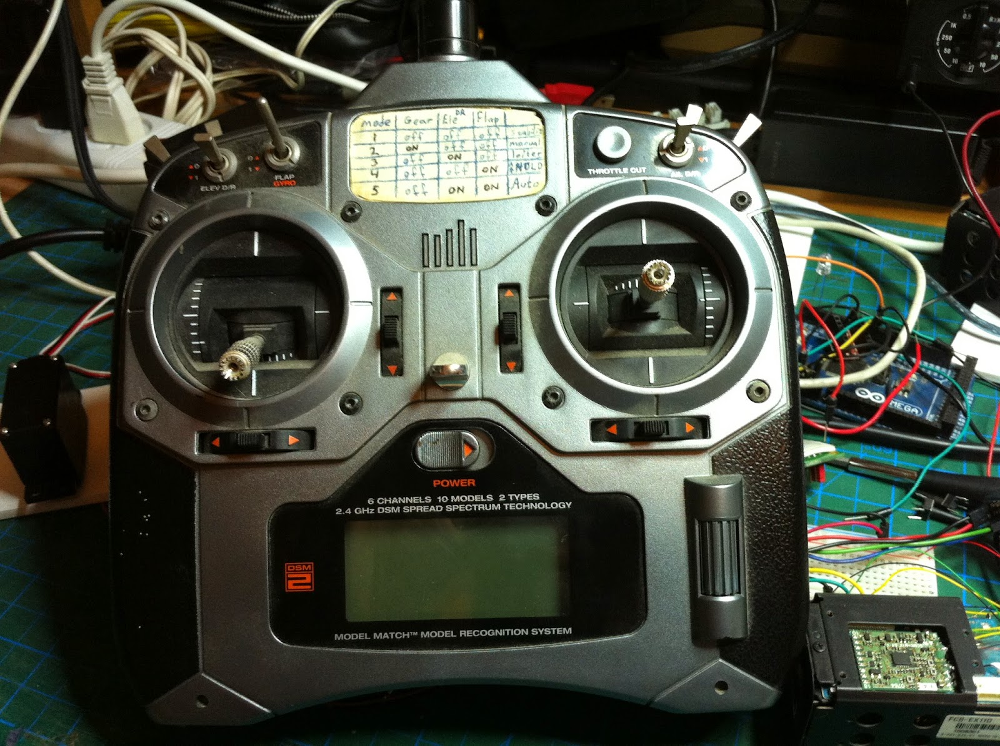

# Sony VISCA Block Camera Control With Arduino and an RC Transmitter

An Arduino reads one RC receiver channel and translates the pulse width into **Sony VISCA optical zoom commands** for an FCB-EX11D block camera.

Read the original build article: **[Arduino RC control for a Sony block camera using VISCA](https://www.eladorbach.com/2014/11/controlling-camera-with-rc-remote.html)**.

Both Arduino and ATtiny85 versions from the 2014 post are preserved under [`legacy/`](legacy/).

## Hardware used in the original build

- Sony FCB-EX11D block camera
- Arduino Pro Mini, 3.3 V
- Spektrum DX6i transmitter
- Spektrum AR6200 receiver
- Composite video monitor

| Wiring | Video test |
|---|---|
|  |  |

## Arduino to Sony VISCA connections

- RC receiver elevator-channel signal → Arduino `D3`
- Arduino serial TX → camera `RxD`
- Common signal ground between receiver, Arduino and camera
- Camera video output → composite monitor
- Camera powered from its appropriate regulated supply

The cleaned sketch is intentionally **transmit-only**: the camera's TX line is not connected to the 3.3 V Arduino input. If bidirectional VISCA is added, level-shift the camera's 5 V CMOS TX signal before feeding a 3.3 V MCU input.

## RC zoom behavior

The sketch uses three pulse-width regions:

- above `1550 µs`: zoom tele
- below `1400 µs`: zoom wide
- center band or missing pulse: stop

It sends a VISCA address-set and interface-clear sequence at startup, then only sends a new zoom command when the requested state changes. A missing RC pulse naturally falls back to `STOPPED`.

## Build

Open `src/sony_visca_rc_zoom.ino` in the Arduino IDE. The sketch uses the standard `SoftwareSerial` library.

## Notes

The original blog also showed an ATtiny85 variant. This repository starts with the cleaner Arduino/SoftwareSerial version because it makes the signal direction and 3.3 V/5 V boundary explicit.
